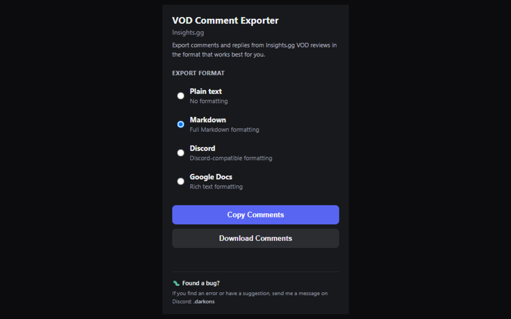

# Insights.gg VOD Comment Exporter

A free Chrome extension that lets you copy and export comments...

## Features

- Export VOD comments and replies
- Copy comments directly to your clipboard
- Download comments as a file
- Plain text
- Markdown
- Discord-friendly formatting
- Rich text for Google Docs
- Audio comments are marked as `[Audio message]`

## How to use

1. Open an Insights.gg VOD review.
2. Click the Insights.gg VOD Comment Exporter icon in Chrome.
3. Choose your preferred export format.
4. Click **Copy Comments** or **Download Comments**.

## Privacy

The extension processes VOD review comments locally in your browser.

It does not use Google Analytics or any other analytics/tracking service.

See [PRIVACY.md](PRIVACY.md) for the full privacy policy.

## Support

Found a bug or have a suggestion?

Contact me on Discord: **.darkons**

You can also open an issue in this repository.

## License

All rights reserved.
